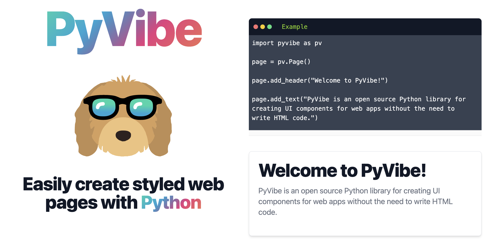

# PyVibe

https://www.pyvibe.com/



PyVibe is a Python library that offers a simple and intuitive way to create UI components for web apps without the need to write HTML code.

## Key Features
- Provides semantic Python components that compile into HTML, making it easy to use with any web framework.
- Comes with a range of semantic Python components, including headers, text, forms, buttons, and links.
- Is designed to work well with Python autocomplete, enabling quick and easy exploration of the available components and their arguments.
- Offers an alternative to hand-coding Flask templates, streamlining UI development for web apps.
- The default style uses TailwindCSS, a popular CSS framework known for its utility-first approach.
- Allows you to insert any HTML into the page by using the Page.add_html() method, providing you with the flexibility to add custom components or use third-party libraries as needed.
- Offers an easy-to-use theming system, allowing you to choose from a variety of pre-built themes, including the default theme based on TailwindCSS.
- Allows for additional themes to be added using different CSS frameworks by accepting pull requests from contributors.

## Why PyVibe?
PyVibe is a great fit for developers who want to:

- Create UI components for web apps using Python code without the need to write HTML.
- Use a Python library that works seamlessly with any web framework.
- Build UIs using a range of semantic Python components with explicit arguments.
- Use a utility-first CSS framework, such as TailwindCSS, to style their UI components without the need for custom CSS code.
- Insert any HTML into the page when a pre-built component doesn't fit their needs.
- Customize the style of their UI components by choosing from a variety of pre-built themes or by contributing new themes that use different CSS frameworks.

## Getting Started
- To get started with PyVibe, simply install the library using pip:

```bash
pip install pyvibe
```
Once installed, you can begin creating UI components by creating a new Page object and adding components to it using the add_* methods. You can then return the page as HTML by calling page.to_html().

For example, to create a new page with a header and a paragraph of text, you could use the following code:

```python
import pyvibe as pv

page = pv.Page()
page.add_header("Welcome to PyVibe!")
page.add_text("PyVibe is a Python library for creating UI components for web apps without the need to write HTML code.")
print(page.to_html())
```
This will output the following HTML:

```html
<div id="page-container" class="container px-5 my-5 mx-auto">
    <p class="mb-4 font-extrabold leading-none tracking-tight text-gray-900 dark:text-white  text-xl sm:text-5xl ">Welcome to PyVibe!</p>
<p class="mb-6 text-lg font-normal text-gray-500 lg:text-xl dark:text-gray-400">PyVibe is a Python library for creating UI components for web apps without the need to write HTML code.</p> 
</div>
```

## Contributions
PyVibe is an open-source library, and [contributions](CONTRIBUTING.md) are welcome! If you have an idea for a new feature or theme, or if you find a bug and want to submit a fix, feel free to open a pull request.

Thanks for considering PyVibe!